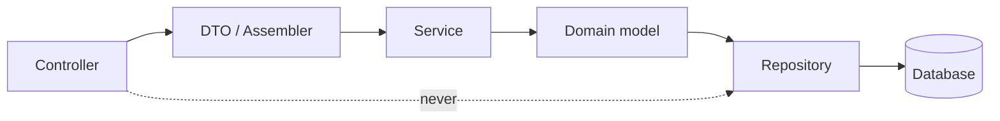

# Study Buddy Matcher System

Study Buddy Matcher pairs university students who should be revising together. A student
registers, lists the courses they are taking, marks their weekly availability, and states how
they like to study: study mode, study goal and preferred group size. The matching engine scores
every other student against them across those five criteria, ranks the results and shows the
score breakdown so a student can see *why* someone was suggested. A student sends a match
request, optionally with a message; the other student's contact number stays hidden until that
request is accepted, and becomes hidden again if either side later ends the connection.
Students can also form study groups for a course, asking to join one, with the group's leader
accepting or rejecting requests and managing members. Administrators manage user accounts and
tune the matching engine's weights and strategy without a redeploy.

Built for IS442 Object Oriented Programming (G2), Singapore Management University.

---

## Tech stack

| Layer      | Technology                        |
| ---------- | --------------------------------- |
| Backend    | Java 21, Spring Boot              |
| Persistence| Spring Data JPA                   |
| Database   | Supabase (hosted Postgres)        |
| Auth       | Spring Security + JWT             |
| Frontend   | React + Vite                      |
| Build      | Maven (backend), npm (frontend)   |

Full list with licences and rationale: [Libraries](#libraries) below.

---

## Prerequisites

| Tool  | Version | Check with       |
| ----- | ------- | ---------------- |
| Java  | 21      | `java -version`  |
| Maven | 3.9+    | `mvn -v`         |
| Node  | 20+     | `node -v`        |

---

## How to run

One-time setup. Copy each environment template and fill in the values:

```bash
cp backend/.env.example backend/.env      # Supabase connection, JWT secret
cp frontend/.env.example frontend/.env    # API base URL
```

**Backend** starts on `http://localhost:8080`:

```bash
cd backend
set -a && source .env && set +a     # Spring Boot reads the environment, not .env
./mvnw spring-boot:run
```

**Frontend** starts on `http://localhost:5173`:

```bash
cd frontend
npm install
npm run dev
```

Vite reads `frontend/.env` on its own, so the frontend needs no export step. The backend does,
because Spring Boot reads the process environment rather than `.env` files. Set the variables
in your IDE's run configuration if you prefer. TODO: Team B to confirm the approach and the
Windows equivalent of the `source` line.

---

## Default logins

Seeded by the data seeder on first run.

| Role          | Email  | Password |
| ------------- | ------ | -------- |
| Student       | TODO   | TODO     |
| Group leader  | TODO   | TODO     |
| Administrator | TODO   | TODO     |

---

## Resetting and reseeding the database

TODO: owned by Team B alongside the data seeder. Document the exact command here once the
seeder exists, including how to drop and recreate the schema against both the local profile and
the shared Supabase instance.

---

## Configuration reference

All configuration lives in `backend/src/main/resources/application.yml`. Secrets are read from
the environment and never committed. See [`backend/.env.example`](backend/.env.example) and
[`frontend/.env.example`](frontend/.env.example).

> This table must be kept in step with `application.yml`. If you add a key, add a row.

| Key                               | What it does                                                        | Default |
| --------------------------------- | ------------------------------------------------------------------- | ------- |
| `spring.datasource.url`           | JDBC URL of the Postgres database                                    | TODO    |
| `spring.datasource.username`      | Database user                                                        | TODO    |
| `spring.datasource.password`      | Database password                                                    | TODO    |
| `spring.jpa.hibernate.ddl-auto`   | Schema generation strategy per profile                               | TODO    |
| `jwt.secret`                      | Signing key for issued JWTs                                          | TODO    |
| `jwt.expiry-minutes`              | How long an issued token stays valid                                 | TODO    |
| `matching.strategy`               | Which `MatchingStrategy` is active                                   | TODO    |
| `matching.minimum-score`          | Matches scoring below this threshold are not returned                | TODO    |
| `matching.weights.course`         | Weight of the shared-course criterion                                | TODO    |
| `matching.weights.availability`   | Weight of the timetable-overlap criterion                            | TODO    |
| `matching.weights.study-mode`     | Weight of the study-mode criterion                                   | TODO    |
| `matching.weights.study-goal`     | Weight of the study-goal criterion                                   | TODO    |
| `matching.weights.group-size`     | Weight of the preferred-group-size criterion                         | TODO    |

Administrators can override the matching weights and threshold at runtime from the admin
matching-config screen; the values above are the startup defaults.

---

## Architecture



Two rules hold this together, and both are checked at review time:

1. **Controllers never touch repositories.** A controller validates input, calls one service
   method and returns a DTO. Nothing else.
2. **Services never return entities to the API.** An entity crossing the API boundary leaks the
   database shape and, in our case, leaks private fields. Services return DTOs assembled by an
   assembler.

The second rule is how contact-number privacy is enforced: `ProfileViewAssembler` decides
between `PublicProfileDto` (no contact number) and `ConnectedProfileDto` (contact number
included) based on whether an accepted connection exists. If an entity were ever returned
directly, the contact number would go with it.

Coding conventions and the reasoning behind this structure: [`AGENTS.md`](AGENTS.md).

---

## Team

Eight students across three teams.

| Team   | Members             | Owns                                                                 |
| ------ | ------------------- | -------------------------------------------------------------------- |
| Team A | nat, cy, jo         | Matching engine: scorers, strategies, scoring config, matching UI     |
| Team B | angel, averyl, gh   | Platform: Spring Boot skeleton, entities, repositories, auth, profile, React skeleton and shell |
| Team C | aryan, charlize     | Connections, study groups, notifications and administration           |

GitHub handles: TODO.

---

## Libraries

Every third-party dependency, what it does for us, what else we looked at, and why we settled
on it. If you add a dependency to `pom.xml` or `package.json`, add a row here in the same pull
request.

| Library | Used for | Alternatives considered | Why this one | Licence |
| ------- | -------- | ----------------------- | ------------ | ------- |
| Spring Boot | Application framework, dependency injection, embedded server, externalised configuration | Plain Java with a servlet container, Jakarta EE, Micronaut | TODO | Apache 2.0 |
| Spring Web (MVC) | REST controllers, JSON request and response handling | Spring WebFlux, JAX-RS | TODO | Apache 2.0 |
| Spring Data JPA | Repository abstraction over Hibernate, entity mapping | Plain JDBC, MyBatis, Hibernate used directly | TODO | Apache 2.0 |
| Hibernate | JPA implementation and object-relational mapping | EclipseLink | TODO | LGPL 2.1 / Apache 2.0, TODO: confirm for the version we pin |
| Spring Security | Authentication, authorisation, the filter chain | Hand-rolled filters, Apache Shiro | TODO | Apache 2.0 |
| JWT library (TODO: pin exact library) | Issuing and verifying signed access tokens | Server-side sessions, opaque tokens with a store | TODO | TODO |
| PostgreSQL JDBC driver | Connecting to Supabase Postgres | (determined by the database) | TODO | BSD 2-Clause |
| Supabase (hosted Postgres) | Shared database for team development and the demo | Local Postgres per developer, H2 in-memory, MySQL | TODO | Apache 2.0 (platform) |
| Maven | Backend build, dependency resolution, test execution | Gradle | TODO | Apache 2.0 |
| JUnit 5 | Unit tests for scorers, interval maths and strategies | TestNG | TODO | EPL 2.0 |
| React | Frontend component model and rendering | Vue, Svelte, server-rendered Thymeleaf | TODO | MIT |
| Vite | Frontend dev server and production build | Create React App, webpack, Parcel | TODO | MIT |
| npm | Frontend dependency management | pnpm, Yarn | TODO | Artistic License 2.0 |

All of the above are permissive or weak-copyleft licences compatible with coursework
distribution. TODO: confirm once exact versions are pinned in `pom.xml` and `package.json`.

---

## Contributing

Architecture rules, coding and design conventions, branch and commit style, and the review
process all live in [`AGENTS.md`](AGENTS.md). Point your AI assistant at it too: Claude Code,
Copilot and Cursor read it automatically.

The agreed API surface between frontend and backend is in
[`docs/API_CONTRACT.md`](docs/API_CONTRACT.md); agree a row there before either side builds
against it.
