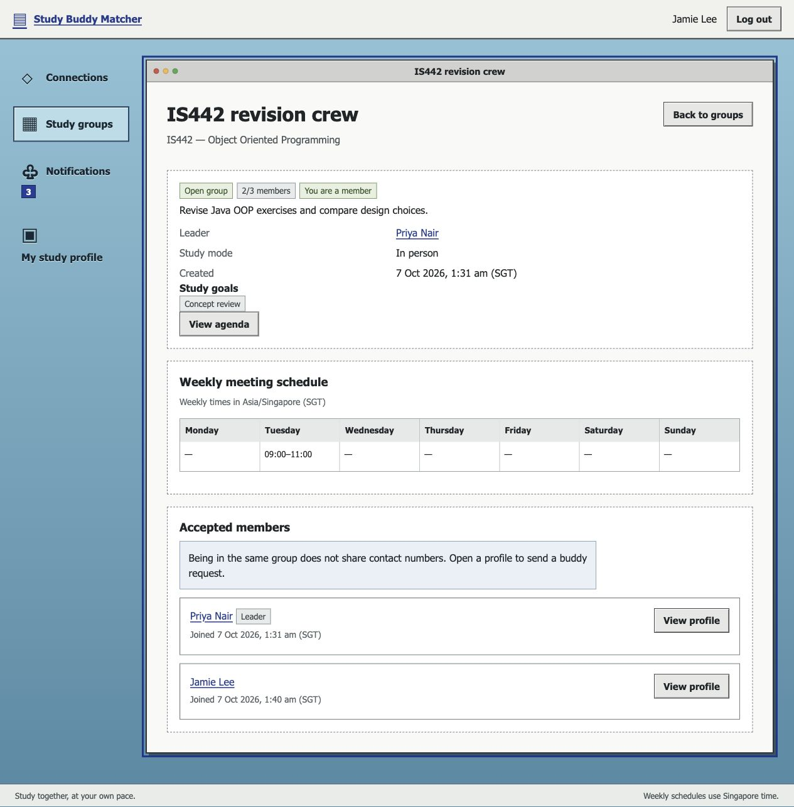

# Team C verification record

Verified on **7 October 2026, SGT**, on `feat/team-c/match-request-state-machine`.
This records actual checks of the implementation tree. Hosted CI, another team's human
review and merge are separate release gates; no hosted green run is claimed here.

## Reproduce automated checks

From the repository root, with Java 21, Docker, `psql` and OpenSSL available:

```bash
scripts/test-backend.sh
```

The runner starts its own official PostgreSQL 17 container on a random loopback port,
generates private database/signing credentials, runs migration upgrade tests in the empty
`studybuddy_migration_test` database, migrates `studybuddy_test`, and runs Maven tests.
It removes its container and temporary credentials on exit. It never loads the shared
Supabase connection. HTTP fixtures refuse to truncate any database other than
`studybuddy_test`; migration fixtures require both their exact test database name and an
empty public schema. Do not point test configuration at shared project data.

```bash
# From frontend; Node 22 LTS, 22.22.2 or newer (locked jsdom requirement)
npm ci
npm test
npm run lint
npm run build
npm audit

# Optional distribution check, from backend after the test run
./mvnw -B -DskipTests package
```

`-DskipTests package` checks packaging only. The backend tests run separately against the
migrated database. Both the executable JAR and its original JAR were inspected: neither
contains `application-local.yml`. Process environment supplies deployed credentials.

## Actual results

| Check | Environment | Result |
| --- | --- | --- |
| Backend unit/context/HTTP/database suite | Java 21, PostgreSQL 17.11, fresh schema | **223 passed across 26 suites; 0 failures, errors or skips** |
| Real HTTP/database integration subset | Random-port Spring server, real JWT/JPA/PostgreSQL | **31 passed** across the four original suites plus LoginConcurrencyTest and NotificationDirectionTest; included above (191 unit + 1 context + 31 integration) |
| Legacy upgrade / rollback / repeat | Separate empty migration fixture database | Passed: invalid duplicate identity rejected without partial changes; all ten legacy event columns converted once; weekly slots preserved; repeat is stable |
| Frontend rendered interactions | Node 22 official container, locked packages, jsdom | **65 passed across 9 suites** |
| Frontend lint/build | Same Node 22 run | 0 warnings/errors; TypeScript and production build passed |
| npm audit | Patched existing transitive lock entry | **0 vulnerabilities** at verification time |
| Backend distribution | Existing Maven JAR/Boot plugins | Packaging passed; private local YAML absent from both JARs |
| Shared Supabase startup/authenticated reads | PostgreSQL 17.6, backend JDBC | Schema validation/startup passed; auth/me, courses and student activity read returned 200 |
| Shared seed repeat | Two backend startups, private runtime passwords | 51 accounts / 50 students / 10 courses; identity/password-hash/creation checksum unchanged |
| Shared database access boundary | Operator metadata plus isolated role execution | 16 RLS tables, 0 browser/PUBLIC application-table grants; actual anon/authenticated reads and writes denied in isolated PostgreSQL |

CI uses the same SQL and test profile on a PostgreSQL 17 service, and Node 22 for frontend
test/lint/build. Every PR into `main`, including workflow-only changes, runs both jobs.
Migration fixtures and repeat migrations run before the backend suite.

## What the tests prove

`BuddyHttpTest` exercises request context and authenticated sender identity, receiver-only
decisions, opposite-direction simultaneous sends, duplicate acceptance, accept/decline
races, recipient-scoped read state/counts/filtering, notification-failure rollback, and
safe invalid/missing-token responses. Literal JSON assertions check both the contact
field and stored value: stranger, pending, declined, group-only peer and disconnected
responses omit them; self and active buddies receive them.

`GroupHttpTest` covers every saved group field, filters, own groups/application history,
leader/member/viewer state, approval/rejection/removal/closure, unauthorized and wrong-group
request IDs, one remaining seat with two approvals, capacity-edit/approval and close/approval
races, duplicate applications, invalid slots/collection values and transactional rollback.
Group and member DTOs contain no contact data.

`AccountHttpTest` covers canonical identity, admin create/edit and write-only contact
replacement, immutable edit role, registration without role elevation, successful/failed
login timestamps, malformed/expired/wrong-role/versionless/revoked tokens, complete
deactivation and permanent-deletion dependency fixtures, safe resource-link removal,
email reuse after deletion, self/last-admin protection with concurrent administrators,
delete/send and deactivate/approval races, invalid creation rollback and UTF-8 password limits.

`DatabaseBoundaryTest` executes actual `SET ROLE anon/authenticated` table reads/writes,
checks SQLSTATE 42501 and verifies backend access still works. It tests unordered pair,
normalized-email, recipient-event and domain constraints directly in PostgreSQL.
Race tests use independent HTTP transactions with a synchronization barrier, then assert
persisted row/state/event counts. Rollback tests deliberately fail notification insertion
and assert the domain mutation did not persist.

Existing domain/service/assembler tests remain, alongside input, token and authentication
tests. Frontend suites cover auth/guards/logout, private profile states, request actions,
group fields/agenda/leader controls, notifications, admin lifecycle/forms, dialog focus,
client validation and stale-request cancellation. A native time-input regression checks
input-only events, invalid slot feedback and the exact valid payload subsequently saved.

The final-review regressions add an actual row-lock wait during an administrator email edit
(`LoginConcurrencyTest`) and recipient-specific notification navigation
(`NotificationDirectionTest`). The login regression reproduced the original bug before
the correction: the old-email request returned 200 after the edit, rather than 401. With
the initial email lookup locked, it returns 401, preserves the new email and does not change
last login; a new-email login and auth/me succeed. Withdrawal, accepted and declined events
carry the correct recipient direction and link to the matching history. Four rendered focus/
timer cases retain request-dialog message/context during a pending fetch while private
profile data is purged; two rendered lifecycle-link cases check Incoming versus Outgoing.

## Running-browser evidence

The actual Vite app called the running backend at port 18080 and an isolated PostgreSQL
database. Three independent in-app browser sessions used synthetic Priya, Jamie and an
administrator; these flows did not modify shared Supabase relationships or delete shared users.

| Journey | Observed result |
| --- | --- |
| Empty requests; profile-origin request with message/course/goal | Saved request appeared in Jamie's incoming view with the same context; unread badge increased |
| Receiver accepts; sender opens connected profile | Contact revealed by the authenticated profile response |
| Sender confirms disconnect and reloads | Contact disappeared immediately; public relationship/request actions returned; answered history remained |
| Create/edit/browse/filter group; View agenda | Name, description, course, mode, goal, capacity and Tuesday 09:00–11:00 saved and displayed consistently |
| Applicant applies; leader approves | Both sessions showed 2/3 accepted members; leader counted once; applicant had no leader controls |
| Leader removes member; applicant reapplies; leader rejects | Counts and application state updated; rejection/removal events appeared |
| Leader confirms group closure | Closed state persisted and disabled applications, decisions and edits |
| Notification filters; mark one/read all; reload | Correct filtered entries; badge changed from five to four to zero and stayed zero |
| Admin creates/edits/deactivates/reactivates a local fixture | Prefilled public fields, preserved omitted contact, correct statuses and fresh-login guidance |
| Admin delete dialog | Explicit dependency list, irreversible wording and typed-email confirmation; submit disabled initially |
| Local fixture permanent deletion over real HTTP | 204 deletion; old student token returned 401; account lookup returned 404 |
| Account search/role/status filters | Correct one-row result with global totals unchanged by filtering |
| Student attempts admin route; logout | Redirected to student connections; logout returned to login and removed protected content |
| Admin narrow viewport override (390×844) | Stacked fields/totals, no document-width overflow; account table scrolls within its container |
| Profile and group request drafts across real background polling | Profile message/course/goal and group application message retained after multiple refreshes; neither draft submitted |
| Final sender-deactivation notice link | Opened Incoming and displayed the matching Declined request, using the final backend DTO |

The final permanent-delete submission was tested through real HTTP and rendered frontend
tests; the browser exercise inspected the confirmation without clicking its irreversible
submit. Invalid/unauthorized/rollback/race behavior is automated rather than claimed from
every manual click. The browser platform was the macOS in-app browser at its default desktop
viewport plus the explicit admin narrow check; this is not an all-browser accessibility audit.

The group screenshot captures Jamie's successful membership before subsequent removal and
closure. It is real saved backend data, rather than a static mock screen:



[Narrow admin screenshot](images/team-c-admin-narrow.jpg).
[Retained request-draft screenshot](images/team-c-request-draft.jpg).

## Restart and shared-environment checks

The isolated backend was stopped and restarted against the same database/signing key with
seeding disabled. Existing Priya/admin sessions remained valid. Browser reloads retained
the closed group, 1/3 members, description/mode/goal and Tuesday schedule; Jamie's fresh
login retained accepted request history and five read notifications with zero unread badge.
The admin fixture retained its edited name and active state. A direct self-profile check
confirmed its unchanged private contact; the admin response still omitted it. The fixture
was then deleted through HTTP and its prior token was rejected.

Shared Supabase migration history records `studybuddy_baseline`, `team_c_integrity`,
`backend_only_database_access` and `collection_goal_primary_keys`; hosted versions are
20261006172737, 20261006172739, 20261006172740 and 20261006173036 respectively. Canonical
SQL filenames retain their authoring versions; do not invent or duplicate hosted history.
All four were validated locally before application. The initial shared schema had no
application data, and a private ignored schema/grants/policies snapshot was retained.
There was no destructive shared reset.

Final Supabase advisors report only informational notices: 16
[RLS-without-policy](https://supabase.com/docs/guides/database/database-linter?lint=0008_rls_enabled_no_policy)
entries are deliberate deny-all for browser roles; 14
[unused-index](https://supabase.com/docs/guides/database/database-linter?lint=0005_unused_index)
entries reflect a newly seeded database before relationship traffic. The two missing goal
primary keys were corrected. No warning/error advisory remains in the returned security
or performance results. Do not add permissive policies or drop supporting indexes just to
remove these informational messages.

## Final review

The requested single GPT-6 Astra medium sweep reviewed the final modified and new source,
tests, migrations and docs after implementation/browser checks. It identified three concrete
P2 issues, with no further actionable findings in the reviewed scope. These were source
findings, not newly executed reproductions by the reviewer; the implementation team supplies
the regression checks and final disposition below.

| Finding | Required correction | Disposition |
| --- | --- | --- |
| Login's pre-lock managed User can revert a concurrent email edit | Lock the initial email lookup, avoiding stale managed fields; prove a blocked old-email login cannot undo the edit | **Fixed**; real PostgreSQL red/green regression and full suite passed |
| Background resource purge unmounts request dialogs and discards drafts | Keep dialog/draft alive using minimal public identity metadata, while purging private profile data | **Fixed**; four focus/timer regressions and real profile/group polling checks passed |
| Sender-deactivation notice links to the recipient's wrong request tab | Return safe recipient request direction and use it for notification navigation | **Fixed**; three HTTP cases, unit direction cases, two rendered link cases and live link journey passed |

No additional review-agent sweep is planned. Human cross-team review, hosted CI and merge
remain external release gates.
