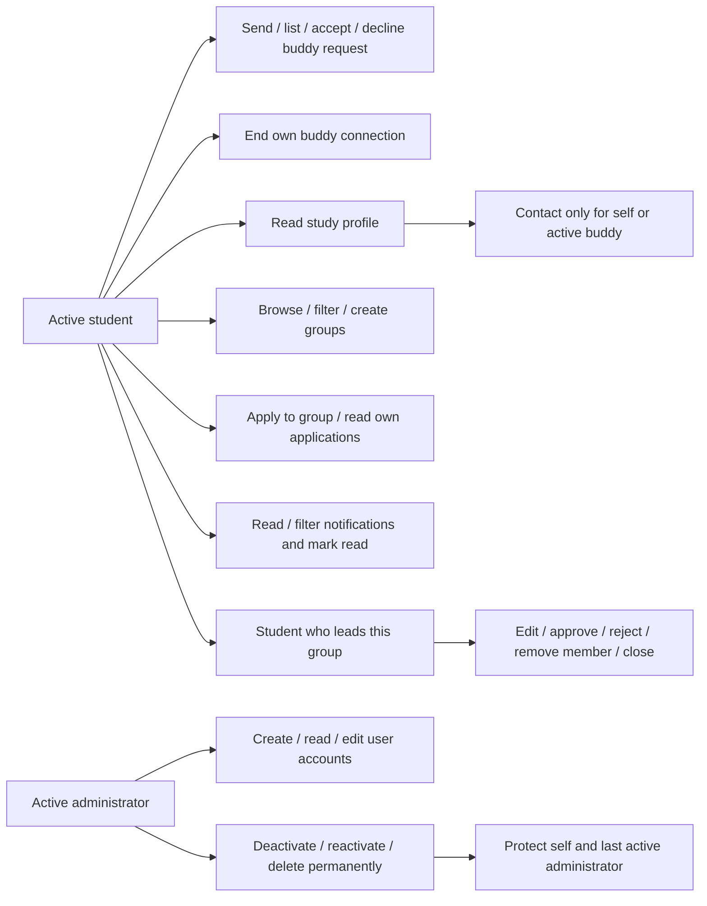
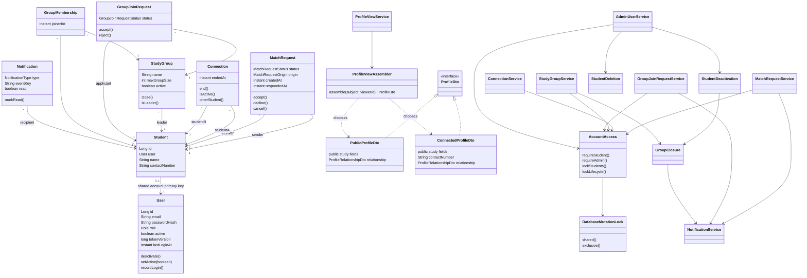
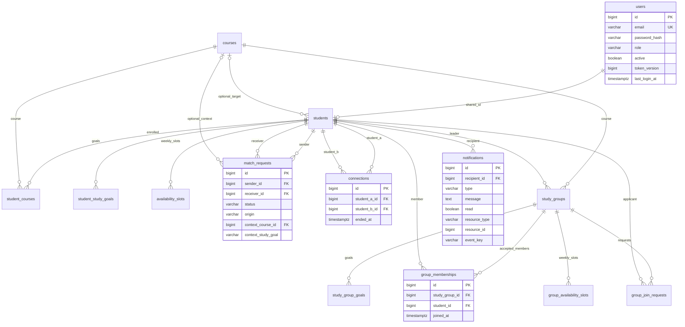

# Team C implementation diagrams

These diagrams describe the implemented composition/DTO/transaction model. The earlier
discussion's Student Leader inheritance sketch is not the implementation: `Student`
composes `User` with `@MapsId`, and `StudyGroup.leader` refers to an ordinary student.
`Role` contains only STUDENT and ADMIN. Matching strategies/scorers remain Team A scope.
The [API contract](../API_CONTRACT.md) contains full DTO fields/endpoints and the
[decisions](../DESIGN_DECISIONS.md) explain privacy, lifecycle and locking choices.

## Use cases and permissions



An incoming request can be answered only by its receiver; a connection can be ended only
by a participant. Leader authority is checked against the URL's particular group. Admin
authority does not bypass profile contact privacy. Server checks remain necessary when
the UI hides or disables unavailable actions.

## Domain and OO boundaries



Services coordinate transactions/authorization; entities own one-way state transitions.
Assemblers select response fields while entities remain internal. Validation and lifecycle
cleanup are separate collaborators, rather than logic in controllers. Value objects and
existing domain enums are reused. Collection fields/course/availability objects omitted
from this overview are shown in the ER diagram and actual source.

## Persisted relationships



Natural collection keys are `(student_id,course_id)`, `(student_id,study_goal)` and
`(study_group_id,study_goal)`. Membership is unique per group/student. Partial unique
indexes protect unordered pending buddy pairs, unordered active connections and pending
group/applicant pairs while allowing terminal history. Non-null recipient/event keys are
unique. Notification resource IDs are safe navigation metadata, not cascading foreign keys;
permanent account cleanup explicitly removes links to deleted records. Matching config/
strategy tables exist in the baseline but are omitted from C's ER view.

## Request acceptance and contact disclosure

```mermaid
sequenceDiagram
    actor Receiver
    participant Controller as MatchRequestController
    participant Service as MatchRequestService
    participant Access as AccountAccess
    participant DB as PostgreSQL
    participant Events as NotificationService
    participant ProfileAPI as ProfileViewController
    participant Profiles as ProfileViewService
    participant Assembler as ProfileViewAssembler
    Receiver->>Controller: POST /match-requests/id/accept + JWT
    Controller->>Service: accept(id, principal.id)
    Service->>Access: shared lifecycle guard; receiver check; sorted account locks
    Access->>DB: lock participant users; recheck active account/version
    Service->>DB: lock request; read current status/active connection
    Service->>Service: MatchRequest.accept()
    Service->>DB: insert one symmetric Connection
    Service->>Events: notify sender, stable event key
    Events->>DB: insert recipient event
    Service->>DB: commit request + connection + notification
    Service-->>Controller: assembled MatchRequestDto
    Controller-->>Receiver: 200 ACCEPTED
    Note over Service,DB: Repeated/racing decisions conflict; any failure rolls back all writes
    Receiver->>ProfileAPI: GET student's profile + JWT
    ProfileAPI->>Profiles: view(subject, principal.id)
    Profiles->>DB: active viewer and subject
    Profiles->>Assembler: assemble(subject, viewer)
    Assembler->>DB: current relationship and public study data
    alt self or active buddy
        Assembler-->>Profiles: ConnectedProfileDto including contact
    else public / pending / ended / group-only
        Assembler-->>Profiles: PublicProfileDto with no contact field
    end
    Profiles-->>ProfileAPI: assembled ProfileDto
    ProfileAPI-->>Receiver: 200 + no-store
```

After disconnect, a later lookup selects the public shape for both sides. The client purges
its current private view and refetches; previously downloaded data cannot be erased remotely.

## Group approval and capacity

```mermaid
sequenceDiagram
    actor Leader
    participant API as GroupJoinRequestController
    participant Service as GroupJoinRequestService
    participant Access as AccountAccess
    participant DB as PostgreSQL
    participant Events as NotificationService
    Leader->>API: POST /groups/groupId/join-requests/id/accept
    API->>Service: accept(groupId, requestId, principal.id)
    Service->>Access: shared guard + sorted leader/applicant account locks
    Access->>DB: recheck account eligibility/version
    Service->>DB: lock group, then request
    Service->>Service: group leader/open; request belongs here and pending
    Service->>DB: recheck no membership and count accepted members
    alt accepted count below capacity
        Service->>Service: request.accept()
        Service->>DB: insert unique membership
        Service->>Events: applicant accepted event
        Events->>DB: insert event
        Service->>DB: commit all
        Service-->>Leader: accepted request DTO
    else full / closed / stale / unauthorized
        Service-->>Leader: safe 400/403/404/409; rollback
    end
    Note over Service,DB: Approval, capacity edits, removal and closure serialize on the same group row
```

Pending applicants do not consume seats. Creation inserts the leader membership. Closure
rejects pending applicants and emits one closure event per other member; it retains history.

## Account cleanup and transactional notifications

```mermaid
sequenceDiagram
    actor Admin
    participant API as AdminUserController
    participant Service as AdminUserService
    participant Access as AccountAccess
    participant Cleanup as Lifecycle collaborator
    participant Events as NotificationService
    participant DB as PostgreSQL
    Admin->>API: deactivate or DELETE account + JWT
    API->>Service: lifecycle(targetId, principal.id)
    Service->>Access: exclusive lifecycle guard
    Access->>DB: lock administrators and target; recheck actor/version
    Service->>Service: block removing own account
    alt deactivate
        Service->>Cleanup: StudentDeactivation.apply()
        Cleanup->>DB: end connections; cancel pending buddy requests
        Cleanup->>DB: close led groups; reject pending applications; leave open groups
        Service->>DB: inactive + increment token version
    else delete permanently
        Service->>Cleanup: StudentDeletion.apply()
        Cleanup->>DB: remove unsafe linked notifications and account dependencies
        Cleanup->>DB: remove led groups and their dependencies; remove profile
        Service->>DB: remove user
    end
    Cleanup->>Events: safe survivor events within same transaction
    Events->>DB: recipient-scoped events, stable unique keys
    Service->>DB: commit or roll back everything
    Service-->>Admin: updated DTO or 204
    Note over Access,DB: Shared writes cannot introduce a relationship during exclusive cleanup
    Note over Service,DB: Reactivation enables fresh login only; no relationship/token restoration
```

Read/read-all operations check the authenticated recipient, persist `read=true`, and are
idempotent. The badge counts all unread events independently of the currently selected
Requests/Groups filter. The backend-only RLS/grants migration closes alternate Supabase
browser data access; backend JDBC is the sole application access path.
